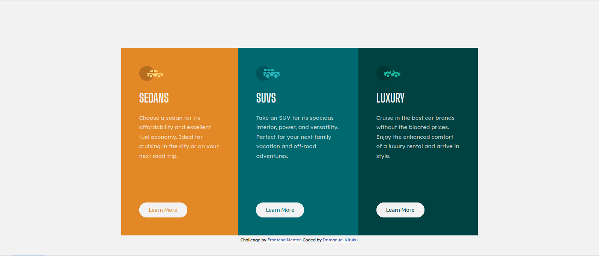

# Frontend Mentor - 3-column preview card component solution

This is a solution to the [3-column preview card component challenge on Frontend Mentor](https://www.frontendmentor.io/challenges/3column-preview-card-component-pH92eAR2-). Frontend Mentor challenges help you improve your coding skills by building realistic projects. 

## Table of contents

- [Overview](#overview)
  - [The challenge](#the-challenge)
  - [Screenshot](#screenshot)
  - [Links](#links)
- [My process](#my-process)
  - [Built with](#built-with)
  - [What I learned](#what-i-learned)
  - [Continued development](#continued-development)
  - [Useful resources](#useful-resources)
- [Author](#author)

## Overview

### The challenge

Users should be able to:

- View the optimal layout depending on their device's screen size
- See hover states for interactive elements

### Screenshot



### Links

- Solution URL: [Github](https://github.com/Manuel254/3-column-card-frontendmentor)
- Live Site URL: [3-column card layout](https://3-column-card-frontendmentor.netlify.app/)

## My process

### Built with

- Semantic HTML5 markup
- CSS3
- Flexbox
- Media queries
- Mobile-first workflow
- Sass

### What I learned
Sass
```scss
//Importing files in sass
@import 'file.scss';

// How to nest elements in sass including the & symbol
.card {
    padding: 3rem;

    &-1 {
        background-color: $orange;
    }

    &-2 {
        background-color: $dark-cyan;
    }

    &-3 {
        background-color: $very-dark-cyan;
    }
}
```
CSS
```css
.container {
    margin-inline: auto; /*Adds margin to left and right */
}
```

### Continued development

- Mobile first development
- Sass
- More on flexbox


### Useful resources

- [Mobile first Design](https://www.youtube.com/watch?v=bn-DQCifeQQ) - Kevin Powell really helped me in understanding the mobile first design.
- [Sass Tutorial](https://www.youtube.com/playlist?list=PL4cUxeGkcC9iEwigam3gTjU_7IA3W2WZA) - This helped me refer to sass as I had somehow forgotten the syntax. If you want to learn sass, I would highly recommend the Net Ninja.


## Author

- Website - [Immanuel Kituku](https://manueltechs.me)
- Frontend Mentor - [@Manuel254](https://www.frontendmentor.io/profile/Manuel254)
- Twitter - [@ManuelTechs](https://www.twitter.com/ManuelTechs)
- Github - [Manuel254](https://github.com/Manuel254)
